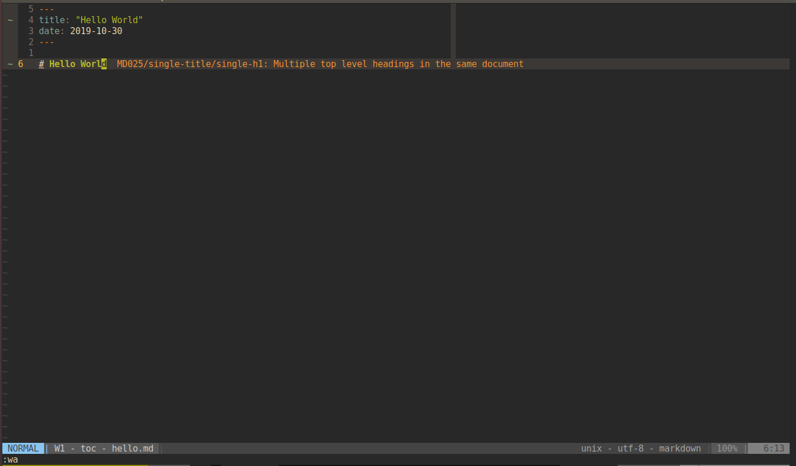

# Hello World



```cpp
#include <iostream>

int main() {
  std::cout << "Hello World" << std::endl;
}
```

```js
console.log("Hello World");
```

```java
class HelloWorld {
  static public void main( String args[] ) {
    System.out.println( "Hello World!" );
  }
}
```
